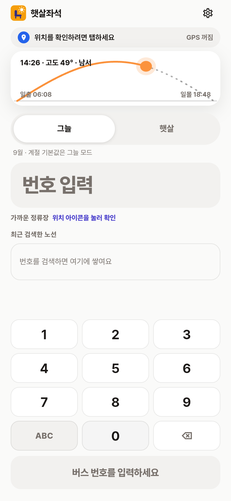

<div align="center">

# 햇살좌석 (SunSeat)

**버스 타기 직전 3초. 어느 쪽 창가에 앉을지만 알려줍니다.**

한여름 오후, 버스에 올라 아무 창가에나 앉았다가 30분 내내 햇볕을 맞아본 적이
있다면 만들려던 게 이겁니다. 노선 번호만 넣으면 **왼쪽인지 오른쪽인지** 하나만
답합니다.

&nbsp;&nbsp;

`Flutter` · `Dart` · `Provider` · 국토교통부 TAGO · 카카오 로그인/맵/로컬

</div>

---

## 어떻게 답을 내는가

버스 좌석의 햇빛은 결국 **버스가 어느 방향으로 달리는가**와 **해가 어디에
있는가** 둘로 정해집니다. 그 둘을 실제로 계산합니다.

| | 하는 일 |
|---|---|
| **1. 노선을 좌표로 받는다** | TAGO에서 경유 정류장을 받아 **위경도까지** 가져옵니다. 승차→하차 구간을 좌표로 잘라, 구간마다 두 점의 대권 방위각으로 **진행 방위**를 냅니다. |
| **2. 그 시각의 태양을 계산한다** | NOAA Solar Calculator를 직접 구현했습니다(`lib/logic/solar.dart`). 위도·경도·날짜·시각 → 방위각·고도·일출·일몰. |
| **3. 측면 일사를 구간별로 합친다** | `sideLoad = sin(고도) × \|sin(진행방위 − 태양방위)\|`. 구간별 값을 **거리로 가중 투표**해 좌·우를 정합니다. |

**답이 "왼쪽 아니면 오른쪽" 하나뿐이라는 게 이 앱의 설계 제약 전부입니다.**
방위각이 조금만 틀려도 답이 **정반대로** 나오는데, 화면은 똑같이 그럴듯합니다.
눈으로는 절대 못 잡습니다.

---

## 만들면서 가장 오래 붙든 세 가지

### 1. 태양을 진짜로 계산해야 했다

처음 구현은 **서울 9월에 맞춘 선형 근사**였습니다. 일출 05:58 / 일몰 19:04가
상수였고, 방위각은 동(90°)에서 서(270°)로 직선 보간이었습니다. 화면상으로는
멀쩡해 보였습니다.

진행방위 0~359°와 낮 시간대를 전부 대입해 옛 식과 실제 계산을 비교했더니:

| | 옛 값 | 실제 | |
|---|---|---|---|
| 6월 서울 08:00 방위 | 118° | 83° | **35° 차이** |
| 1월 서울 일출 | 05:58 | 07:46 | **1시간 48분 차이** |
| **좌우 추천이 뒤집히는 비율** | | | **6월 18.5% · 9월 9.1% · 1월 1.4%** |

여름엔 다섯 번에 한 번꼴로 **반대 좌석**을 알려주고 있었습니다.

지금은 NOAA 알고리즘으로 실제 계산합니다. 검증은 특정 사이트 수치를 베끼지 않고
**천문학적 사실**로 고정했습니다 — 남중 방위 180°, 남중고도 = 90° − 위도 + 적위,
춘분 정동 일출, 하지 북동·동지 남동 일출, 위도별 낮 길이, 경도별 일출 순서
(`test/solar_test.dart`).

### 2. 검색 한 번에 API를 138번 쓰면 서비스가 안 된다

TAGO는 `cityCode`가 **필수**라 "도시를 모르는 검색"이라는 게 없습니다. 사용자는
자기 버스가 어느 시에 등록됐는지 모르는데 말입니다. 순진하게 짜면 전국 138개
도시를 다 물어보게 되고, 개발계정 일일 한도가 1,000건이니 **앱 전체를 통틀어
하루 일고여덟 번 검색하면 한도가 끝납니다.** 스토어 배포에 성립하지 않습니다.

범위를 단계적으로 넓히도록 바꿨습니다:

| 단계 | 범위 | 호출 수 |
|---|---|---|
| 1 | 카카오 로컬로 좌표 → 행정구역 → 그 도시 | **1~2회** |
| 2 | 못 찾으면 같은 도(道) 전체 — 광역버스가 옆 시에 등록된 경우 | 수십 회 |
| 3 | 그래도 못 찾으면 전국 (마지막 수단) | 138회 |

여기에 두 가지를 더 붙였습니다. 즐겨찾기 **백그라운드 프리페치는 전국 검색을
금지**했습니다 — 사용자가 요청하지도 않은 작업이 즐겨찾기 하나당 138번을 쓰면
앱을 켜는 것만으로 한도가 날아갑니다. 그리고 **TAGO가 담당하지 않는 지역(서울)
에서는 전국 검색을 아예 건너뜁니다.** 138개를 다 훑어도 나올 리 없는 헛수고인
데다, 사용자에게는 "번호를 확인해 주세요" 대신 **"서울 버스는 아직 지원하지
않아요"**라고 이유를 말해줘야 합니다. 그러지 않으면 번호만 계속 고쳐 넣게 됩니다.

### 3. 데이터가 없으면 지어내지 않는다

이 앱에서 가장 많은 시간을 쓴 원칙입니다. 프로토타입에는 그럴듯한 가짜가 곳곳에
있었고, **가짜는 진짜와 똑같은 화면에 똑같은 모양으로 나옵니다.**

| 있었던 것 | 실제로는 | 지금 |
|---|---|---|
| 구간별 일사를 **노선번호 해시**로 칠함 | 노선이 어디로 가는지도, 해가 어디 있는지도 안 봄. 노선을 뒤집어도 결과가 같았음 | 실제 정류장 좌표로 구간을 자름 |
| 구간 범주에 **'지하·터널'** | 그 데이터를 가진 적 없음. `(i + hash) % 6 == 2`를 터널이라 칠하던 것 | 범주 삭제 |
| 결과 화면 "**건물 그림자 반영**" | 건물 높이 데이터 없음 | "직사광 기준(건물 그림자 미반영)" |
| 설정 데이터 출처 "**기상청 일사량**" | 기상청 API를 부르지 않음 | 실제로 쓰는 셋만 표기 |
| 홈 화면 최근 노선 칩 (9401·3401·140) | 서울 노선 — TAGO로는 검색해도 안 나옴 | 실제 조회에 성공한 노선만 |
| 위치 바 "강남역 11번 출구 근처" | 위치를 켠 적도 없는데 표시 | 카카오 로컬로 받은 실제 지명 |

**좌표가 없는 노선**은 구간 막대를 그리지 않고 "구간별로 나눌 수 없어요"라고
말합니다. 가짜 막대보다 빈 자리가 낫습니다.

---

## 정직성을 코드로 강제한 부분

가짜 데이터보다 더 위험한 건 **조용한 실패**였습니다.

근접 정류소 API가 몇 주 동안 한 번도 성공한 적이 없었는데 아무도 몰랐습니다.
오퍼레이션 이름에 오타(`getCrdntPrxmtStaionList` → `getCrdntPrxmtSttnList`)가
있었고, 호출부가 예외를 삼키고 대체 경로로 넘어가서 **화면에는 캡션이 그냥 안
뜰 뿐**이었기 때문입니다. 심지어 그 실패를 "활용신청이 안 됐나 보다"로 이틀간
오진했습니다 (실제 원인은 명세서를 받아 대조하고서야 나왔습니다).

그래서 지금은:

- **요청 URL과 응답을 테스트로 고정합니다.** 오퍼레이션 이름, `gpsLati`/`gpsLong`의
  대문자 L(응답은 소문자라는 비대칭까지), 그리고 **실제 응답 원문 그대로**
  (`test/tago_station_url_test.dart`, `test/tago_station_parse_test.dart`).
- **키가 없으면 그렇다고 말합니다.** 웹 미리보기 빌드는 키 없이 컴파일되는데,
  예전에는 "네트워크를 확인해 주세요"라고 했습니다. 네트워크는 멀쩡한데요.
  지금은 홈 상단에 이유를 표시하고 검색 버튼을 비활성으로 둡니다.
- **틀렸던 판단은 지우지 않고 기록합니다.** [엔지니어링 노트](ENGINEERING.md)의
  "겪은 함정 모음"이 그것입니다.

---

## 검증

`flutter test` **50개** · `flutter analyze` 오류·경고 **0**

| 테스트 | 잡는 것 |
|---|---|
| `solar_test` | 태양 방위·고도·일출을 천문학적 사실로 검증 (답이 반대로 나오는 걸 막음) |
| `segments_test` | 노선을 뒤집으면 태양이 반대쪽에 오는지, 꺾이는 노선의 구간별 방위 |
| `tago_city_resolver_test` | 실제 138개 도시 목록으로 지역 매칭 고정 (`세종특별시` ↔ `세종특별자치시` 등) |
| `tago_station_url_test` · `tago_station_parse_test` | API 요청 철자와 실제 응답 모양 |

API는 브라우저·curl로 실제 응답을 받아가며 붙였습니다 — TAGO 노선/정류소,
카카오 로컬 모두 실호출로 확인했고 응답 원문을 문서에 남겼습니다.

> **아직 실기기에서 돌려보지 못했습니다.** 개발 환경에 Android/iOS SDK가 없어
> `analyze`/`test`까지만 자동 검증했습니다. 스토어 출시 전 남은 일은
> [엔지니어링 노트](ENGINEERING.md#남은-일)에 우선순위대로 정리해 뒀습니다.

---

## 직접 열어보기

**[화면 미리보기 (웹)](https://kangjungmook.github.io/busseat-sun/)** — 설치 없이
화면 구성을 볼 수 있습니다. 단, **공개 빌드에는 API 키를 넣지 않으므로 노선 검색은
동작하지 않습니다** (공개 저장소에 키가 박히기 때문). 앱이 그 사실을 화면에서
알려줍니다.

```bash
cp secrets/dart_defines.example.json secrets/dart_defines.json   # 키 채우기
flutter pub get
flutter run --dart-define-from-file=secrets/dart_defines.json
```

키 설정과 카카오 콘솔 절차는 [엔지니어링 노트](ENGINEERING.md#실행) 참고.

---

## 구조

```
lib/
  logic/       태양 방위/고도, 좌석 판정, 구간 일사, 지오 — 전부 순수 함수
  services/    TAGO 노선·정류소, 카카오 로그인·로컬, 위치, 캐시
  state/       AppState (Provider ChangeNotifier)
  screens/     13개 화면
  models/      노선·즐겨찾기 · TAGO 응답 DTO
  theme/       색·타이포·스페이싱 토큰
  widgets/     커스텀 페인터(태양 궤적/좌석 지도/경로 지도)
test/          50개
```

계산 로직(`logic/`)은 네트워크도 상태도 모릅니다. 위도·경도·시각·좌표만 받아
값을 돌려주는 순수 함수라서, 태양 계산이 틀렸다는 걸 테스트로 잡을 수 있었습니다.

---

## 현재 상태

| | |
|---|---|
| ✅ 검증됨 | 노선 검색·정류장 좌표(TAGO), 좌표→행정구역(카카오 로컬), 근접 정류소, 태양 계산, 구간별 일사 |
| ⚠️ 코드는 완료, 실기기 미검증 | 카카오 로그인, 카카오맵 WebView, 앱 안에서의 실제 API 왕복 |
| ❌ 미지원 | 서울 (TAGO 미담당 — 서울시 API를 따로 붙여야 함) |
| ❌ 출시 전 필수 | 릴리스 서명(현재 디버그 키), 개인정보처리방침 URL |

지원 지역은 **138개 시·군**입니다. 서울이 빠져 있고 강원도는 6곳뿐이라
(강릉·속초 없음) 스토어 설명에 밝힐 예정입니다. 자세한 목록과 남은 일은
[엔지니어링 노트](ENGINEERING.md)에 있습니다.
